# VIDEO STREAMING - UI (Next.js + Redux Toolkit + Redux Saga)

**About:** Frontend UI of the video streaming website demo. Responsive UI built using Next.js 13, Redux Toolkit, Redux Saga, Typescript, Tailwind CSS.

**_Check backend API: [https://github.com/remankader/video-streaming-api](https://github.com/remankader/video-streaming-api)_**

**Features:**

- Video upload with _title_, _category_ and optional _about_ fields.
- Auto conversion to streaming friendly video using [Fluent ffmpeg](https://github.com/fluent-ffmpeg/node-fluent-ffmpeg).
- Homepage with category sections.
- Single page layout for each category.
- Search functionality.
- Video page with highly customizable [ReactPlayer](https://github.com/CookPete/react-player).
- Responsive design using [Tailwind CSS](https://tailwindcss.com/docs/overflow).

## Screenshots

### Desktop

| | | |
|:-:|:-:|:-:|
| 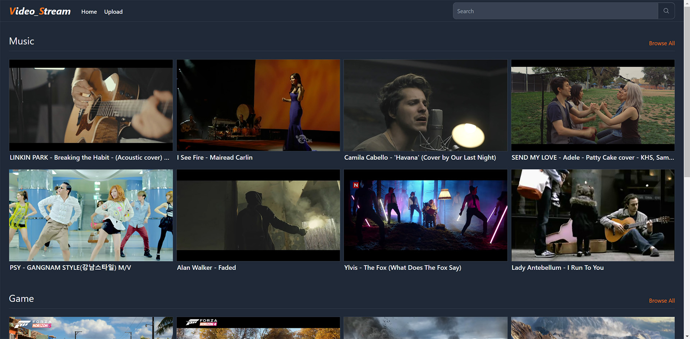 | 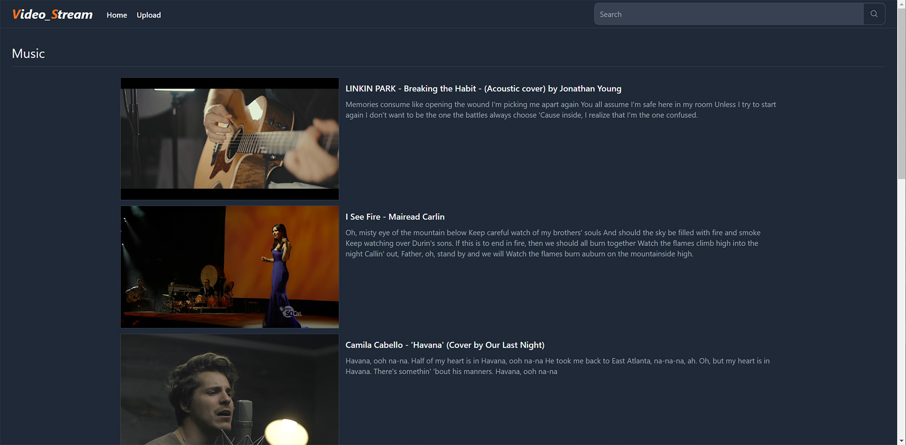 | 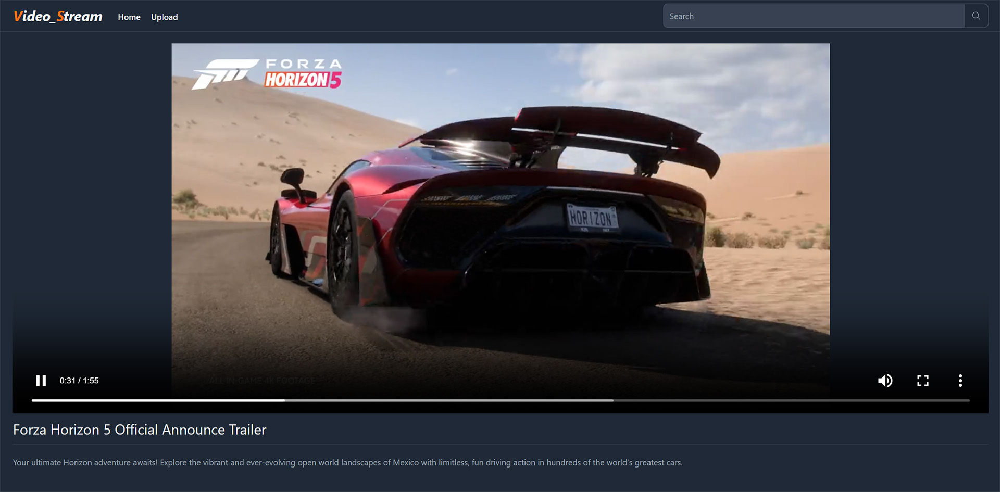 |
| Home Page | Single Page | Player Page |

| | | |
|:-:|:-:|:-:|
| 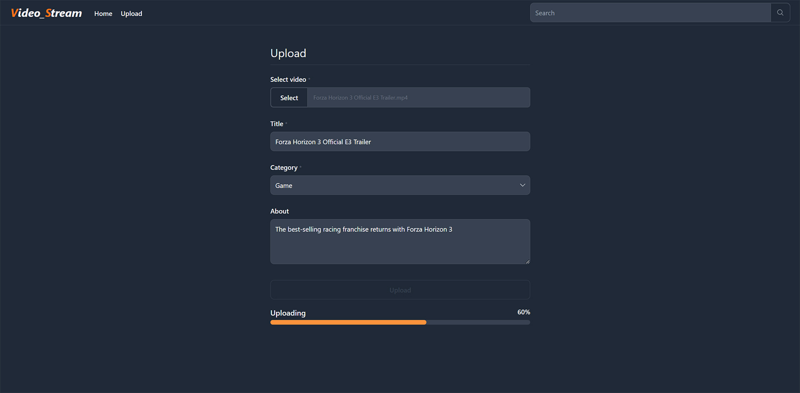 | 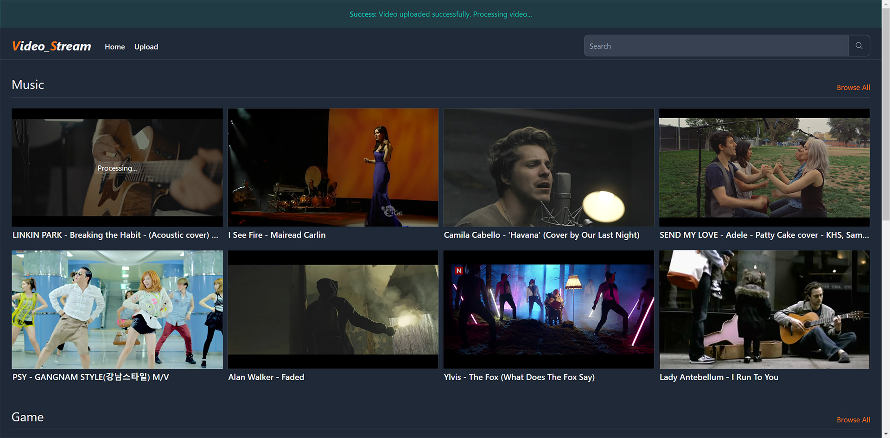 | 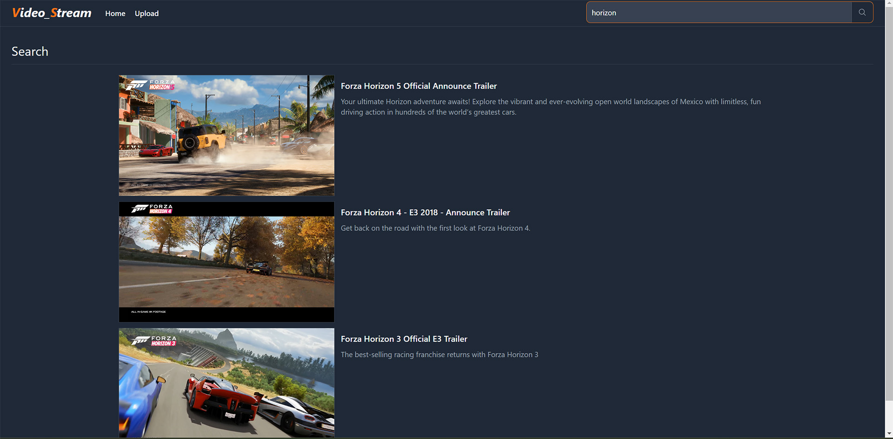 |
| Upload Page | Upload Success | Search Page |

### Mobile

| | | | | | |
|:-:|:-:|:-:|:-:|:-:|:-:|
| 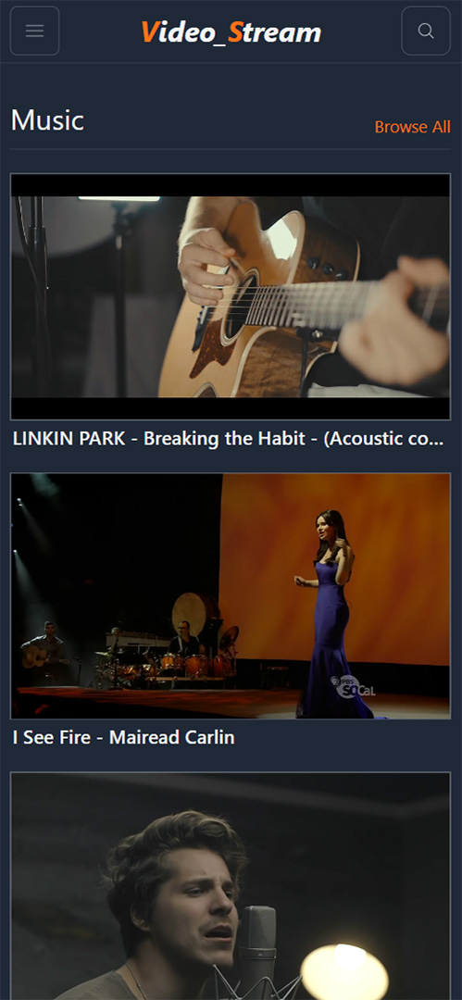 | 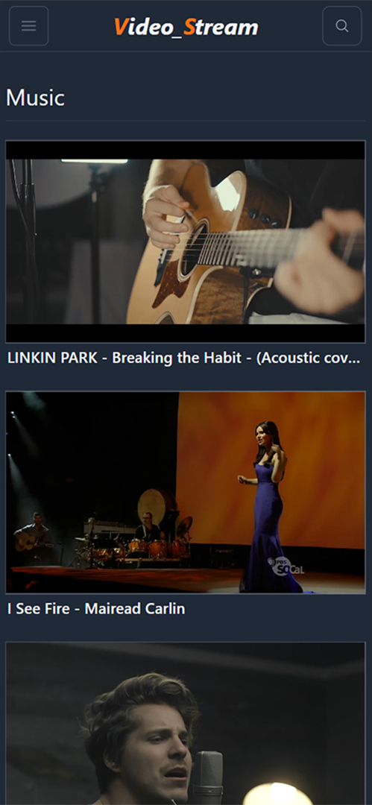 | 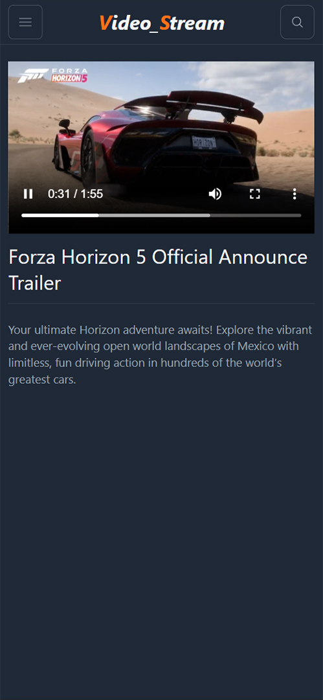 | 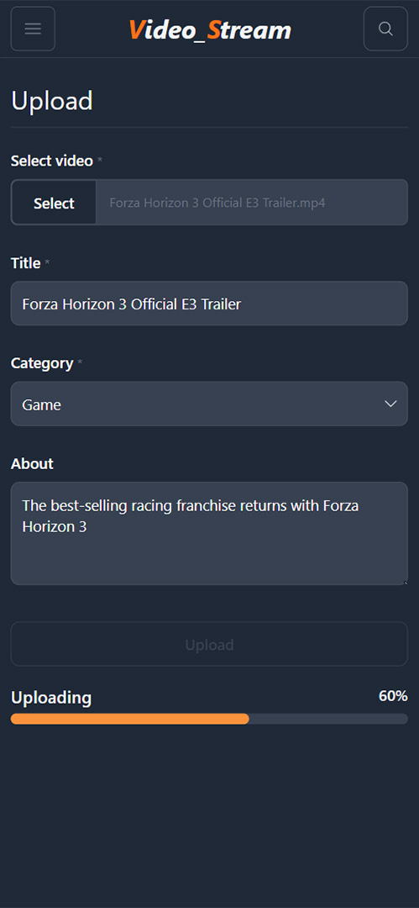 | 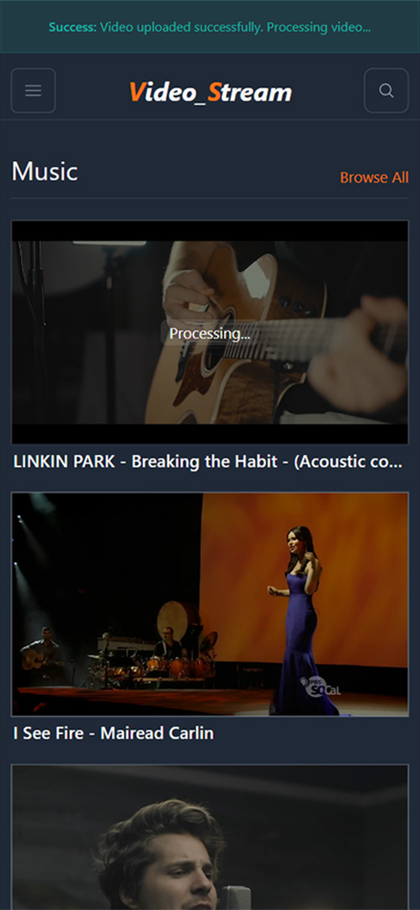 | 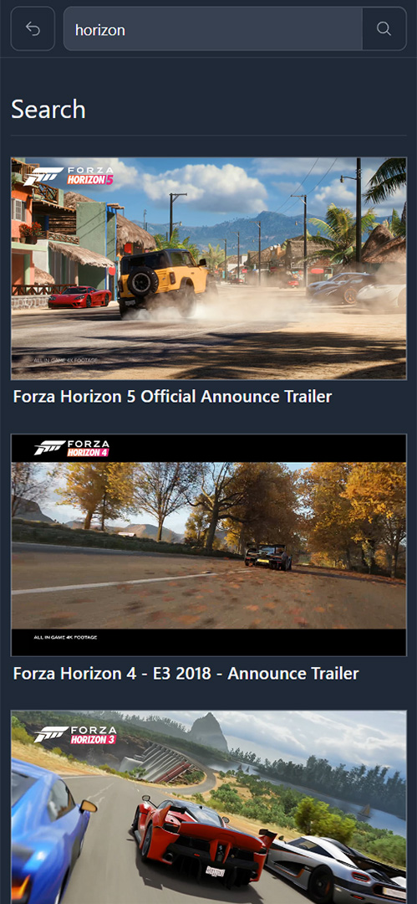 |
| Home Page | Single Page | Player Page | Upload Page | Upload Success | Search Page |

## Start Development Server

- **Step 1:** On root directory make a copy of **.env.local.example** and rename it to **.env.local**

- **Step 2:** Set/update values in **.env.local**

- **Step 3:** Install dependency packages by running:

```bash
npm install
# or
yarn install
```

- **Step 4:** Start development server by running:

```bash
npm run dev
# or
yarn dev
```

- **Step 5:** Open [http://localhost:3000](http://localhost:3000) with your browser.

**_[ Built on Node v18.15.0 ]_**
